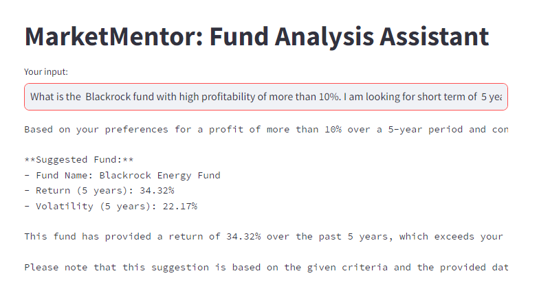

# MarketMentor
Market Mentor

# Market Mentor App

**Fund Suggestor** is an AI-powered (LLM) financial tool designed to help users select the best funds based on specific parameters. This fully automated system analyzes mutual funds and stocks using several indicators and displays results through a user-friendly chat interface. Users can get detailed insights about which funds to invest in and why.

Currently it suggests, the mutual funds from curated database. Can be extended further to include funds of anay  choice.

## Features
- **Fund Recommendations**: Get personalized mutual fund suggestions based on user-defined parameters.
- **Stock Analysis**: Analyze any stock in the market using financial indicators.
- **Indicators**:
  - **SMA (Simple Moving Average)**: Tracks the average price of a stock over a set period.
  - **EMA (Exponential Moving Average)**: Gives more weight to recent prices for trend detection.
  - **RSI (Relative Strength Index)**: Measures stock momentum to determine if it's overbought or oversold.
  - **MACD (Moving Average Convergence Divergence)**: Tracks stock trend direction and strength.
- **Chat Interface**: Get real-time recommendations through simple, chat-based queries.

For all the Indicators and Analysis, backed is connected with Yahoo Finance API for real-time data fetching.

## Installation

1. **Clone the repository**:
   ```bash
   git clone https://github.com/your-repo/fund-suggestor.git


## Requirements
- yfinance
- matplotlib
- pandas
- streamlit
- dotenv

## Environment Variables
Create a .env file in the root directory with your API keys and configurations. Example:

OPENAI_API_KEY=<your_api_key_here>
OPENAI_ORG=<your_api_key_here>

# Usage
## Run the app:

```streamlit run app.py```


## Available Functions:

- **getStockPrice(ticker)**: Returns the latest closing price of the stock.
- **calculateSMA(ticker, window)**: Computes the Simple Moving Average (SMA) for a specified window.
- **calculateEMA(ticker, window)**: Computes the Exponential Moving Average (EMA) for a specified window.
- **calculateRSI(ticker)**: Calculates the Relative Strength Index for the stock.
- **calculateMACD(ticker)**: Computes the MACD, including the signal and histogram.
- **plotStockPrice(ticker)**: Plots the closing price of the stock over the past year.

# App Images




# Future Extensions for Market Mentor App

## 1. Portfolio Analysis
- Build a feature to allow users to input their current portfolio and get analysis on diversification, risk exposure, and potential areas of improvement.
- Add functionality for suggesting rebalancing strategies based on market conditions or user-defined intervals.

## 2. Additional Financial Metrics
- Integrate additional metrics such as Sharpe ratio, Sortino ratio, and alpha for more detailed insights.
- Provide a breakdown of sector allocation, asset class distribution, and other portfolio composition metrics.

## 3. Machine Learning Model for Predictions
- Integrate machine learning models to predict future fund or stock performance based on historical data and trends.
- Offer AI-driven recommendations based on predictive analysis for long-term returns.

## 4. Integration with Brokerage Accounts
- Provide integration with users' brokerage accounts, allowing them to directly buy or sell funds and stocks based on suggestions.
- Track portfolio performance within the app after executing trades.

## 5. Expand Global Market Coverage
- Expand the app to cover more global markets and mutual funds from various regions.
- Provide options for currency conversions and region-specific financial metrics.

